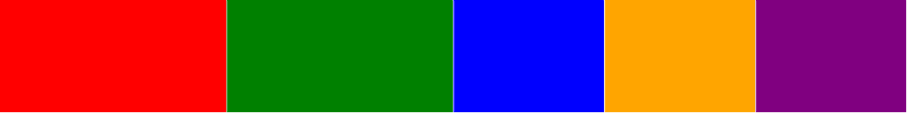
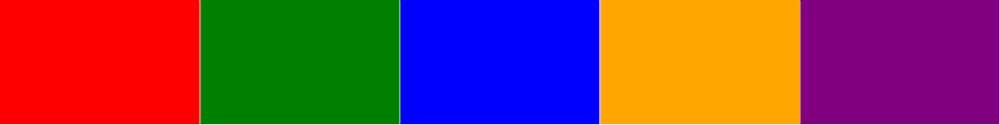
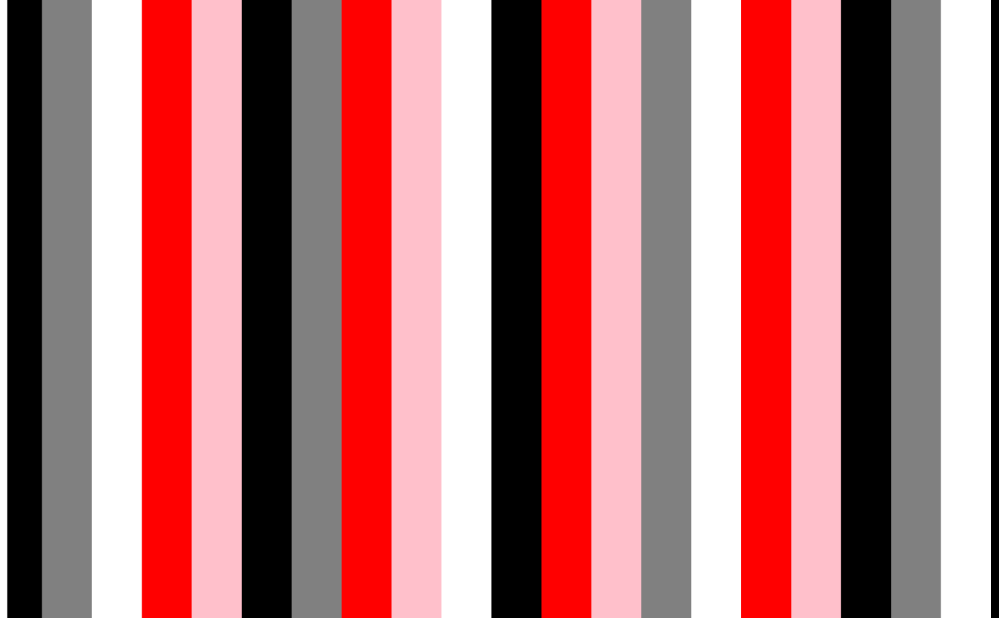

---
bibliography: src/Alpaca.json
csl: acm-sig-proceedings.csl
nocite: |
  @krishnaMusicJustice2020
...

\epigraph{In all Indian musical traditions, learning, rationalization and sharing are part of an internal process within and between artists. The magnificence of this non-scribal technique is the acceptance of diversity and the possibility of continuous musical change. The internalization of structure and form in the art, the role of memory and rediscovering without written reference keeps the music moving and varied. Every voice is not identical; the possibility of music bending and swaying across regions, traditions and time is real. At no point is the music etched in stone, trapped in time, a stone tablet of commandments.}{T. M. Krishna, "Music and Justice" [5]}

# Introduction

The above epigraph from T. M. Krishna celebrates the role of living memory and continuous change in 'non-scribal' musical practice. From my European perspective this is refreshing, when printed staff notation has such a hold over music-related scholarship in the West. However, this oral/scribal distinction in music is less clear in digital musics where notations can be open to change and even ephemeral, for example the 'from-scratch' style of live coding, where notations are written, manipulated and (finally) deleted live, gaining an improvisatory, time-bound, ephemeral quality. In these respects, live coding is closer to active speech than printed notation. This suggests that the comparatively new practice of live coding has a great deal to learn from the Indian practices referred to by T. M. Krishna.

Towards this end, in the following I compare the South Indian vocal practice of _konnakol_ with contemporary algorithmic music, as a means to develop new live coding practice. The conduit for this work is the software development of the TidalCycles and Strudel live coding environments, adapting their representations for musical pattern inspired by Carnatic rhythmic structures. I will conclude with a search for musical meaning in this approach, including consideration of cultural appropriation, and the possibilities of creating performances that shift between live coding of the computer and of the self.

# Konnakol

Konnakol is an ancient Carnatic musical practice, developing since around 200CE [@sankaranArtKonnakkolSolkattu2010a, p. 3]. Konnakol involves the oral recitation of _solkattu_ phrase groups of vocable words, which are non-lexical, but closely associated with articulations of the mridangam drum, as well as movements within the bharatanatyam dance tradition. As a non-scribal, oral tradition, konnakol is generally transmitted and learned through recitation and listening rather than via notation. Konnakol rhythms are highly complex and heavily syncopated with frequent changes of speeds, and e.g. addition/subtraction of beats from successive repetitions. Still, there is always a steady underlying pulse, where konnakol artists are able to perfectly match their rhythmic transformations to a particular _tala_ structure. While performing, konnakol artists mark the tala with their hands, for example by repeating a sequence of clap-finger counts (laghu) and clap-waves (drutam).

As a mono-lingual English speaker, I am unable to access much of the literature on the art form, but in English "The Art of Konnakkol" by Trichy @sankaranArtKonnakkolSolkattu2010a is an excellent practical introduction which covers some historical and cultural context, and vocalist and activist T.M. Krishna is a key reference for cultural and political background on Carnatic music [@krishnaSouthernMusic2017]. Lisa Young has made her Masters and PhD theses on konnakol available
[@youngKonakkolHistoryDevelopment1998,@youngKonakkolHistoryDevelopment1998], Rafael Reina has a book on applying Carnatic rhythmical techniques to Western Classical music [@reinaApplyingKarnaticRhythmical2015a], and David Nelson has published a Solkattu Manual [@nelsonSolkattuManual2008]. For a computer music perspective, an interview by Rotherham-based musician Mark Fell with the Glasgow-based Indian musician Nakul Krishnamurthy is full of insight, exploring improvisation, notation and tradition in Carnatic music
[@fellStructureSynthesisAnatomy2022, pp. 243-259].

## Learning Konnakol

However, nothing can stand in for actually learning and practising konnakol rhythms.^[I use the phrase _konnakol rhythms_ advisedly; konnakol is a rich art form, the majority of which I have not touched on. So far my focus has been on rhythm.] Indeed, we should take care not to be too distracted by what Kofi Agawu calls "paper rhythms" [@agawuStructuralAnalysisCultural2006]; those rhythmic transformations which are apparent on paper, but have no living reality when performed, listened to and danced to. I have been lucky to take elementary konnakol lessons with renowned percussionist B C Manjunath, changing how I think about and make both music and music software.

This learning process has allowed me to develop a sense of internal pulse within a tala, and to feel how rhythms move around within that tala. It has felt like learning rhythm from multiple perspectives -- it is one thing to learn to recite a sequence, and something quite different to learn to do so while clapping the tala. The rhythms then feel different depending on whether I am attending to the syllables, the rhythmic structure, or the tala. I sometimes write the syllables down to help understand the structure of a rhythm, but it is only when I leave that notation behind that I begin to _really_ learn and feel a rhythm. It is hard to explain in words, but taking in a new rhythm can at times be a slightly frustrating process of learning and forgetting as I come at it from different directions.

Konnakol rhythms are fundamentally algorithmic, and this is why it is possible to recite long, complex compositions without notation; the performer generates music based on simple numerical principles applied to a deep, embodied knowledge of rhythm. Or as B C Manjunath puts it:

"You cannot be complex just for the sake of being complex ... [The Spanish dish] paella is complex, it has a lot of elements in it... but it is built out of many simple things. [If they are] imbibed into each other, then that becomes complex. ... If you understand that you are trying to make something complex then that is a failure of a musician. The complexity should be for others, but for me it should be simple." ^[Quoted from this interview with B C Manjunath:
https://www.youtube.com/live/6kYwZ8S-qBQ?feature=shared&t=1761]

<!-- Improvisation - quote from Mark Fell's interview with Narkul -->

<!-- "Rules are always redefined ... You learn a rule, and that becomes the -->
<!-- new norm - that becomes the rule. Then the already defined rule, the -->
<!-- area ... becomes larger, and then you teach it to wsomeone else. They -->
<!-- learn this rule, some people want to stay in the same circle but some -->
<!-- people want to forget half of it, maybe they remember half of it; they -->
<!-- break the rule, and that becomes a new norm, you know? So rules are -->
<!-- always being set. But, there are always some rules which ... must not -->
<!-- be broken. These rules are so strong because it's hard to break them -->
<!-- ... these are time-tested rules. If you try to question them, there is -->
<!-- always an answer, but you have to be intelligent enough to find the -->
<!-- answer. So only someone who knows the rules really well can break the -->
<!-- rules." - live coding is up to this challenge. -->

<!-- Paraphrasing; any computer sound can be formalised in konnakol but not -->
<!-- vice-versa, because the body is a much more advanced system for -->
<!-- thinking about sound than any computer. -->

# TidalCycles and Strudel - live coding languages for pattern

TidalCycles and Strudel are software environments for live coding that I have been adapting to better represent konnakol-inspired rhythmic structures. TidalCycles (known as Tidal for short) is a domain specific language embedded in the pure functional Haskell programming language, and was developed by myself from 2009, becoming a thriving free/open source project with many contributors [@mcleanMakingProgrammingLanguages2014]. In recent years, Tidal has been ported to several multi-paradigm languages, most notably to JavaScript as "Strudel" [@roosStrudelLiveCoding2023]. Strudel has largely reached feature parity with Tidal, with some differences following from the different constraints and opportunities of JavaScript, as well as some additional e.g. user interface, visualisation, and tonality features. This paper discusses features implemented in both -- for ease of explanation I will refer to the Haskell types when discussing implementation, and for accessibility to the reader with a web browser to hand, I will share examples written in Strudel. They have their own lives, but for the purposes of this paper, lets consider them two sides of the same coin.

As systems for making music^[Tidal and Strudel have also been used for other pattern-based media, such as making visuals, choreographies and textiles.], Tidal and Strudel enjoy vibrant communities of practice, supporting performances and workshops worldwide. These technical and cultural developments are inseparable, in that Tidal is a software environment for thinking about and creating music, but it is the end-user community of artists that populated that environment and established its musical and cultural meaning. For this reason I consider them to be software environments and not prescriptive software tools. It has been a privilege to be involved in these cultural developments, including through online community building, festival organisation and development of the wider algorave movement [@collinsAlgoraveSurveyHistory2014a]. The software and community had to develop together; one could not have been imagined without the other.

## Musical patterns as functions of time

The affordances of Tidal, Strudel and other ports follow from their common, core representation of patterns as functions of time. This is inspired by signals in Functional Reactive Programming [@elliottPushpullFunctionalReactive2009], but with support for both discrete events and continuously varying values within the same `Pattern` datatype.

```haskell
type Time = Rational
data TimeSpan = TimeSpan {begin :: Time, 
                          end :: Time}
data Event a = Event {whole :: Maybe TimeSpan, 
                      active :: TimeSpan, 
                      value :: a}
data Pattern a = 
    Pattern {query :: TimeSpan -> [Event a]}
```

A pattern then, is a function from (rational) time to events. A pattern function is queried for a particular timespan window, and returns events taking place within that window. Each such event consists of a value, and a timespan during which that event value is active within the queried time window. Discrete events have an additional timespan representing an event's 'whole' timespan. This is needed to represent an event that is a fragment of a larger one; this occurs where an event extends outside the queried window, or where a pattern transformation slices up events into parts.

Because patterns are functions, they are highly composable, in both the computer scientific and musical sense. However one problem with patterns is that there are a diverse multitude of ways to compose them together. As a result, Tidal defines a range of applicative function application and monadic bind/join functions. With a rich combinator library of pattern transformations, Tidal provides rich and flexible domain-specific library, designed to terse and expressive enough to be used during live performance.

Strudel is implemented in JavaScript, and so does not have the benefits of a type system. Nonetheless it is a faithful port of Tidal as described above, including its approach to applicative and monadic-style functional composition. Indeed, all the examples in the following are in implemented in Strudel, so that the reader can play with them in a web browser without having to install Tidal.

## Expanding Tidal and Strudel to support Carnatic-esque patterns

One limitation of representing patterns with functions is that they are opaque, so that when combining two patterns, it's difficult to fully consider the structure of those patterns. Take for example concatenation -- appending one pattern to another. Functions of time are in principle infinite, so we can never reach the end of the first pattern in order to play the second one. Tidal's answer to this is cycle-based composition, where a cycle is roughly equivalent to a measure or bar in Western classical music, but is perhaps closer to the idea of a tala cycle in Indian music. Rather than concatenating whole patterns, Tidal concatenates successive cycles, resulting in a cyclic interleaving of patterns.

```javascript
cat("red green", "blue orange purple");
```

{ height=3% width=40%}

As you can see in the above visual example using Strudel, each cycle is split in half, with the first half containing two events of one quarter of cycle each, and the second half having three events of one sixth of a cycle each.^[The double-quoted text denotes the 'mini-notation', a mini-language implemented in both Strudel and Tidal for describing potentially complex polymetric rhythms. Here they are used to describe simple contiguous sequences.]  Sometimes however, we might want divide time up 'stepwise', so that each event in the resulting pattern has equal duration, taking up one fifth of a cycle. Indeed, stepwise transformation and composition of patterns is a pervasive feature of Carnatic music. Strudel and Tidal now have an `s_cat` (stepwise cat) function for this:

```javascript s_cat("red green", "blue orange purple");
```

{ height=3% width=40%}

In the above, all five steps have the same duration. Even for this basic functionality, the `s_cat` function needs to know something about the structure of the two patterns in order to combine them. That is not possible when composing functions of time together, as the structure of the patterns is not known until the resulting function is later queried.

It took two different attempts to support this stepwise functionality. The first was to create a pattern type class, with the existing functional patterns as one instance, plus an additional type instance implementing patterns as data structures. This worked to a large extent, with a great deal of functionality implemented relative to the type class, rather than the two instances. However despite much work, I came to the conclusion that this approach was over-complicated, which showed in the end-user interface. I eventually settled on a simpler approach, based on the idea of maintaining the
'tactus' of a pattern.

## Musical tactus

In music, the _tactus_ is a high-level pulse felt in the music, known as the 'clapping rate', or the pulse that an individual or crowd chooses to clap along with in a piece of music. There is work to automatically infer the most likely tactus from a piece of music or audio signal in the Music Information Retrieval field, however the tactus is often ambiguous. One person might clap twice or half the speed of another, and even more problematically, in polyrhythmic music, each listener must choose which rhythm to clap to. A trained musician might even mark multiple tactuses with different limbs. Including tactus in a musical representation therefore requires this ambiguity to be confronted.

In Tidal and Strudel, the tactus is simply added as an optional pattern field, along with an additional `pureValue` field. In Tidal and therefore Haskell:

```haskell data Pattern a = 
    Pattern {query :: State -> [Event a],
             tactus :: Maybe Time,
             pureValue :: Maybe a
            }
```

Stepwise functions can then use the tactus when combining patterns, for example to find the relative proportion to create equal steps in the result of `s_cat`. The `pureValue` field holds a value only for 'stable' patterns, i.e. those of a single value that repeat once per cycle. This is maintained to support tactus calculation; a tactus can only be calculated by pattern transforming functions where certain arguments are stable.

On this basis, a range of additional stepwise pattern combinators are defined, all prefixed by `s_`.

The result of our earlier `s_cat` example is the equivalent of `"red green blue orange purple"`; this has a tactus of `5`, being the sum of its component tactuses. However, the tactus of our earlier `cat` example is ambiguous. There at least four possibilities:

a) clapping the onsets of component patterns = tactus of 2
b) clapping according to the elements of the first component = tactus of 4
c) clapping with the elements of the second compoents = tactus of 6
d) clapping the lowest common multiple of both components = tactus of 12

Currently, a) is the default, and either b) or c) can be specified by marking one or the other as being the 'strong' component with a caret (`^`) symbol (e.g. `cat("^red green", "blue orange purple")` for b). d) is the result when both components are marked as 'strong' with `cat("^red green", "^blue orange purple")`, giving the tactus where every event falls on a 'clap'.

## Stepwise combinators

The combinators are in a fairly early stage of development, with the aim of making konnakol-inspired rhythms easy to express. For example, the `s_taper` function is inspired by `yati` structures, where phrase lengths are successively reduced or increased by one. The below applies `s_taper` to an integer sequence form 1 to 8, first building and then reducing the sequence by one step per repetition, as visualised in Fig. 1.

\begin{figure*}
\centering
\includegraphics[width=1\textwidth]{figures/mrdangayati.png}
\caption{mridanga yati}
\end{figure*}

```javascript
stack(note("1 2 3 4 5 6 7 8")
          .s_taper("-1 1", 8), 
      s("clap clap wave").fast(6)
     );
```

This increasing and decreasing is known as a _mridanga yati_, and is shown with the underlying clap-clap-wave pattern of the rupaka tala. Because the yati pattern has seventy two steps, and the tala has three, we can fit one cycle of the yati to six cycles of the tala, where we clap or wave every 4 steps of the yati.

```javascript
"red pink".s_tour("black", "grey", "white")
```

{ height=3% width=40%}

The `s_tour` function above adds the "red pink" pattern progressively backwards through each repetition of the black-grey-white sequence. Note that in these examples, only the first repetition is shown, but as a function of time, the pattern will repeat forever.

\begin{figure*}
\centering
\includegraphics[width=1\textwidth]{figures/misrachapu.png}
\caption{Grouping in Misra Chapu}
\end{figure*}

```javascript
stack("1 2 3 4 5 6 7".s_expand("3 2 1 1 2 3"),
      "wave wave - clap - clap -".fast(6)
     )
```

The above use of the `s_expand` function repeats the 1-7 integer sequence for each element in the 3, 2, 1, 1, 2, 3 sequence, but expanded by the given factor. The result is a 84 step pattern, which fits the 7-step "wave wave -
clap - clap - " cycle of the _misra chapu_ tala, as visualised in Fig. 2.

# Fitting the tala

According to Trichy Sankaran, the term _tala_ is used in a broad sense to describe all important rhythmic principles, but also in a specific sense to refer to metrical cycles
"... composed of traditionally determined rhythmic units which are indicated through conventionally followed hand gestures." The tala provides the ground for rhythm, influencing our experience of rhythmic patterns significantly, being
"the foundation upon which intricate devices of cross-rhythm and syncopation are built.[@sankaranArtKonnakkolSolkattu2010, pg. 36]

It is important for a piece to align with the cyclic time-measure of a particular tala, by having a total number of beats divisible by the duration of the tala. In other words, the piece should perfectly end at the _sam_ -- the beginning and therefore also the end of a cycle. A subsection within a piece need not fit the tala, however. For example a traditional _Korvai_ is divided into two sections, with the second part containing groups of three repetitions of a phrase, each group repeated three times divided by gaps. The piece can then fit the tala by adjusting the repeated phrase or the duration of gaps between groups. The konnakol or mridangam artist calculates how to best fit the piece to the tala through such adjustments.

## Calculation as music

From a computer scientific perspective, this looks like a problem to solve; we could attempt to formalise an algorithm for fitting a korvai to a tala. However, at this point we should pause and consider where we draw the line of automation. As B C Manjunath points out^[See B C Manjunath's answer to a question on formalisation of Konnakol:
https://www.youtube.com/watch?v=6kYwZ8S-qBQ&t=2697s], the body is a much more advanced system for thinking about sound than a computer.

This notional 'line of automation' divides aspects abstracted and automated by a computer, from those that we creatively and directly engage with as humans. Konnakol is by its nature computational, requiring calculation as part of its artistry, but this does not mean that we wish to automate it. Just as people do not generally start to learn to play the guitar by building a robot, we should be careful not to approach music as a problem to solve. Fundamentally, music is an activity, and as music-makers, we want to immerse ourselves in that activity.

Indeed, live coders use programming languages not to automate the generation of music, but to turn programming itself into music-making, as a means of creating music in and for the moment. In this I argue that they are not only lead by ideas but more importantly by perception of musical outcomes. Live coding environments support immediately turning an idea into music, but it is perception of the musical outcome with all its unexpected rhythmic complexities and juxtapositions that inspire the next edits to drive the music forward. Rather than attempting to codify the rules of konnakol then, I focus on allowing musicians to choose, adapt and apply rules themselves, inspired by konnakol.

# Developing practice

To be meaningful, the technical development of computer music language should be part of a wider development of a culture of creative practice around it. To explore this, I decided to adopt a rule that I would no longer ask my computer to perform a musical algorithm that I could not perform myself. This constraint works to define a creative space, push my rhythmic practice forward, and create possibilities for shifting between and integrating code-driven and vocal performance of an algorithm.

This approach has lead me to develop a performance practice that integrates live coding with algorithmic vocal patterns, involving the audience in clapping the tala and encouraging them to look for and feel the syncopations which result, and perhaps sense the heritage connection between algorithmic patterns [@mcleanAlgorithmicPattern2020] in vocal recitation and computer music. I am in the process of developing this practice through live performance, and informal feedback from my first public performance trialling this approach at EMF camp (May 2024, Eastnor UK) has been encouraging.

*TODO* - Corsica + quote from Lu

# Cultural appropriation

Developing live coding practice inspired by konnakol as a European is of course an act of cultural appropriation. Although intermixing of cultural sources is common and broadly accepted as a function of music, it can be problematic, whether through misattribution, exploitation, copyright theft, or in the case of Deep Forest's "Sweet Lullaby", all three [@feldSweetLullabyWorld2000]. Kofi Agawu [@agawuAfricanImaginationMusic2016, pp. 305–334] provides an informative perspective on the pervasive spread of musics of Africa and the African diaspora in the global north. Agawu weighs appropriation against homage, and issues of copyright around traditional music where the notion of ownership does not normally apply. He does see use of traditional African 'timeline' rhythms in western minimalist compositions as potentially positive in drawing affinities with traditional music while creating something novel in a new context, but it is a complicated picture.

Returning to Carnatic music, it is certainly important to understand some of the wider context of its rhythms when making systems inspired by konnakol. This includes recognising its background in ancient sacred texts, as well as reflecting on ongoing debates on the role of caste privilege in music between traditional and progressive voices. For now, I simply acknowledge that towards my aim of enriching algorithmic music with heritage algorithms I _am_ appropriating culture, and explore the resulting tensions through scholarship and collaboration, while opening myself to criticism, and opening the software itself as free/open source software.

# Conclusion

Konnakol throws a great deal of light on 'from-scratch' live coding practice. Too often, algorithmic music is reduced to sequencing, repetition and randomness, but konnakol demonstrates how rich the generative possibilities of pattern can be when the focus is on human memory and perception, rather than fixed notation. By developing hybrid practices that involve both human- and computer-realised algorithms, we are able to embody abstraction so that we can creatively improvise with algorithms through our bodies, reclaiming computation from automation.

# Acknowledgements

This work is funded by a UKRI Future Leaders Fellowship [grant number MR/V025260/1].

## References
